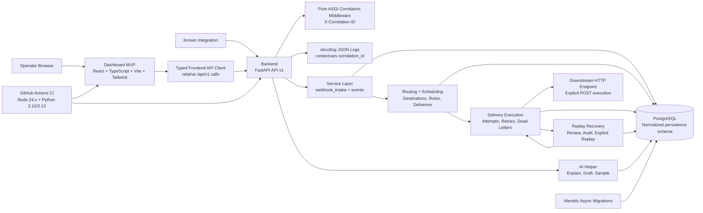

# RelayGuard Phase 6 Architecture

PostgreSQL remains unconnected during startup and normal unit tests. Phase 1B added SQLAlchemy ORM metadata and an immutable initial Alembic migration for the normalized persistence foundation. Phase 1C adds idempotent seeding, PostgreSQL-only integration validation against the isolated test database on host port `5434`, and a forward `0002` migration that expands replay-request terminal statuses. Phase 2 adds `0003_webhook_intake_support` for receipt request metadata, duplicate receipt status, event-type length alignment, and accepted event timestamps. Phase 3 adds `0004_routing_schedule` to enforce idempotent delivery scheduling for each event, destination, and routing rule. Phase 4 adds `0005_delivery_execution` to store delivery execution timestamps/errors, attempt outcomes, retry job claim/completion metadata, pending retry uniqueness, and dead-letter reason metadata. Phase 5 adds `0006_replay_workflow` to store replay update/execution/resolution timestamps and to treat `running` replay requests as active for database-backed uniqueness. Phase 9 adds no migration; the AI helper reads safe metadata and returns structured assistant output without storing analyses.

The schema uses UUID primary keys, UTC-aware timestamp columns, string status columns with check constraints, JSONB only for payload/configuration/schema/audit documents, and PostgreSQL partial unique indexes where domain rules require them.

## Phase 6 frontend dashboard flow

1. The React dashboard uses a small typed API client in `frontend/src/lib/api.ts`.
2. During local development, Vite proxies relative `/api` requests to `http://127.0.0.1:8000`; production-like builds can use `VITE_API_BASE_URL` if needed.
3. The dashboard loads process health, safe integration metadata, recent events, dead letters, and replay requests on startup. If the backend is unavailable, it renders an explicit unavailable state instead of crashing.
4. Operators can activate or disable sandbox integrations through `PATCH /api/v1/integrations/{integration_slug}`. The endpoint updates only existing `enabled` and `status` fields and returns no secrets.
5. Destination and routing forms call the existing Phase 3 APIs. Webhook testing calls the Phase 2 intake API and stores recent returned event IDs in local UI state.
6. Event, delivery, attempt, retry, dead-letter, and replay panels call the existing safe metadata APIs and never display raw event payloads or response bodies.
7. Delivery execution and replay execution remain explicit button-driven API calls. Phase 6 does not add a browser-side fake lifecycle, background worker, external queue, authentication, signature verification, AI execution, or a downstream mock service.

## Phase 2 intake flow

1. `POST /api/v1/integrations/{integration_slug}/webhooks` looks up the integration by slug before parsing the body.
2. Unknown integrations return `404` and create no receipt, because no integration foreign key exists.
3. Known integrations read the raw body, compute a SHA-256 hash, capture safe request metadata, and manually validate content type, JSON, and the envelope.
4. Disabled or invalid known-integration requests create one rejected `webhook_receipts` row and create no canonical event, payload, state transition, delivery, retry, replay, dead-letter, or AI record.
5. Active valid requests create a receipt, then insert a canonical `events` row with PostgreSQL conflict-safe behavior. The unique `(integration_id, deduplication_key)` constraint and partial unique `(integration_id, source_event_id)` index enforce deterministic deduplication.
6. Accepted inserts create exactly one `event_payloads` row and one initial `event_state_transitions` row from `NULL` to `accepted`.
7. Duplicate inserts update the new receipt to `duplicate` and return the existing event ID without creating another event, payload, or state transition.
8. `GET /api/v1/events/{event_id}` returns safe metadata only and never returns payload contents.

Normal health/startup behavior and `make check` remain database-free. Replay execution, authentication behavior, signature verification, and AI execution remain deferred.

## Phase 3 routing and scheduling flow

1. Operators can create downstream destination metadata for a known integration. Destination configuration is checked for secret-like keys and is never used to execute HTTP calls in Phase 3.
2. Operators can create routing rules for destinations in the same integration. A rule stores deterministic match criteria in `routing_rules.match_configuration`, currently `{"event_type": "..."}`.
3. `POST /api/v1/events/{event_id}/schedule-deliveries` loads an accepted canonical event, active routing rules for its integration, and active destinations.
4. A route matches only when its configured `event_type` exactly equals the canonical event's `event_type`. Disabled rules, disabled destinations, and non-matching rules are ignored.
5. For each matched active route, RelayGuard inserts one `event_deliveries` row with status `scheduled`, `attempt_count` zero, and `next_attempt_at` set to the current UTC timestamp.
6. The Phase 3 uniqueness constraint prevents duplicate delivery rows for the same event, destination, and routing rule. Repeated scheduling calls report existing matched deliveries without creating duplicates.
7. Phase 3 keeps canonical events in `accepted` status while delivery records wait for explicit execution. No delivery attempts, retry jobs, dead letters, replay requests, or AI records are created during scheduling.

## Phase 4 delivery execution and retry flow

1. `POST /api/v1/deliveries/{delivery_id}/execute` loads one due delivery with status `scheduled` or `failed`, its destination, and the stored canonical event payload.
2. RelayGuard sends one HTTP `POST` with `Content-Type: application/json` and the stored payload document. It does not add signatures, authentication headers, webhook secrets, or response-body logging in Phase 4.
3. Every execution attempt creates one `delivery_attempts` row with a monotonically increasing attempt number, safe outcome metadata, status code when available, safe error code/message, and retryability classification.
4. HTTP `2xx` marks the delivery `delivered`, sets `delivered_at` and `last_attempt_at`, clears retry state, and advances the event to `delivered` when all deliveries for the event are delivered.
5. Retryable failures are timeout, network/connect errors, and HTTP `429`, `500`, `502`, `503`, or `504`. The delivery moves to `failed`, `next_attempt_at` is set using deterministic backoff, and one pending `retry_jobs` row is created for the delivery/run target.
6. Non-retryable HTTP client-side failures and exhausted retryable failures move the delivery to `dead_lettered`. The `dead_letter_events.delivery_id` unique rule guarantees exactly one dead-letter record per delivery.
7. `POST /api/v1/retry-jobs/{retry_job_id}/execute` claims one due pending retry job, reuses the same delivery execution path, and marks the retry job completed when execution runs.
8. Phase 4 has no background worker or external queue. Execution happens only through explicit API requests, which keeps retry/dead-letter decisions deterministic and testable.

## Phase 5 replay and recovery flow

1. `POST /api/v1/dead-letters/{dead_letter_id}/replay-requests` creates a pending replay request only for an open dead letter whose delivery is still `dead_lettered`.
2. The database-backed active replay uniqueness rule permits only one `pending`, `approved`, or `running` replay request for the same dead letter.
3. Operators explicitly approve or reject replay requests. Approval moves `pending` to `approved`; rejection moves `pending` or unstarted `approved` requests to `rejected`.
4. `POST /api/v1/replay-requests/{replay_request_id}/execute` only runs approved requests. The service marks the request `running`, reopens the original dead-lettered delivery as a due failed delivery, cancels stale pending retry jobs, and calls the existing delivery execution service.
5. Replay execution sends the same stored event payload to the original destination through the Phase 4 delivery path. It records a normal new `delivery_attempts` row and preserves all earlier attempts.
6. Successful replay marks the delivery `delivered`, marks the replay request `resolved`, resolves the original dead-letter record, and writes execution/resolution audit entries.
7. Replay attempts that run but still fail mark the replay request `executed`, leave the dead letter open, and rely on Phase 4 idempotency to avoid duplicate retry jobs or duplicate dead-letter rows.
8. Create, approve, reject, execute, resolved, and unresolved execution outcomes write safe `audit_logs` entries without payloads, response bodies, credentials, or secrets.
9. Phase 5 keeps replay explicit and human-reviewed. It adds no background worker, external queue, authentication behavior, signature verification, AI execution, or frontend recovery UI.

## Phase 9 AI helper flow

1. The AI helper is an assistant layer exposed under `/api/v1/ai/*`.
2. `explain-delivery` loads only safe metadata: delivery status, event type/status, destination
   name/status/type, delivery attempt outcome/status code/error code, retry job status, and
   dead-letter status. It never reads or sends stored event payload contents to the helper output.
3. `draft-replay-note` loads dead-letter, delivery, attempt, and replay-request metadata, then
   returns suggested reason/approval text. It does not create, approve, reject, or execute replay.
4. `sample-webhook-payload` generates a sample webhook envelope for operator review. The frontend
   can insert the sample into the Webhook Tester, but the user still submits explicitly.
5. If no external AI provider is configured, the fallback provider returns deterministic structured
   output and labels `mode: "fallback"`. Future providers must preserve the same metadata-only
   prompt boundary and structured response shape.
6. AI helper output never controls webhook intake, deduplication, routing, scheduling, delivery
   execution, retry classification, dead-lettering, or replay execution. Those reliability
   decisions remain deterministic application code.
