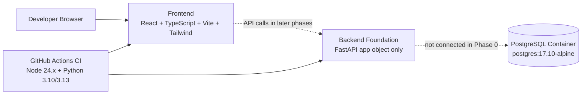

# RelayGuard Phase 0 Architecture

```mermaid
flowchart LR
  U[Developer Browser] --> F[Frontend\nReact + TypeScript + Vite + Tailwind]
  F -. API calls in later phases .-> B[Backend Foundation\nFastAPI app object only]
  B -. not connected in Phase 0 .-> D[(PostgreSQL Container\npostgres:17.10-alpine)]
  CI[GitHub Actions CI\nNode 24.x + Python 3.10/3.13] --> F
  CI --> B
```

PostgreSQL is provisioned only as an unconnected development/test Compose skeleton in Phase 0.
