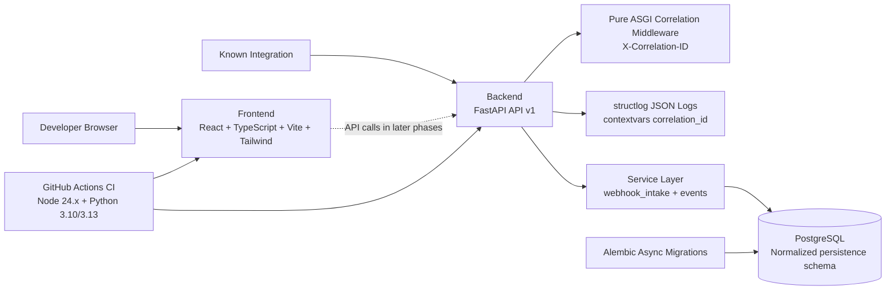

# RelayGuard Phase 2 Architecture

PostgreSQL remains unconnected during startup and normal unit tests. Phase 1B added SQLAlchemy ORM metadata and an immutable initial Alembic migration for the normalized persistence foundation. Phase 1C adds idempotent seeding, PostgreSQL-only integration validation against the isolated test database on host port `5434`, and a forward `0002` migration that expands replay-request terminal statuses. Phase 2 adds `0003_webhook_intake_support` for receipt request metadata, duplicate receipt status, event-type length alignment, and accepted event timestamps.

The schema uses UUID primary keys, UTC-aware timestamp columns, string status columns with check constraints, JSONB only for payload/configuration/schema/audit documents, and PostgreSQL partial unique indexes where domain rules require them.

## Phase 2 intake flow

1. `POST /api/v1/integrations/{integration_slug}/webhooks` looks up the integration by slug before parsing the body.
2. Unknown integrations return `404` and create no receipt, because no integration foreign key exists.
3. Known integrations read the raw body, compute a SHA-256 hash, capture safe request metadata, and manually validate content type, JSON, and the envelope.
4. Disabled or invalid known-integration requests create one rejected `webhook_receipts` row and create no canonical event, payload, state transition, delivery, retry, replay, dead-letter, or AI record.
5. Active valid requests create a receipt, then insert a canonical `events` row with PostgreSQL conflict-safe behavior. The unique `(integration_id, deduplication_key)` constraint and partial unique `(integration_id, source_event_id)` index enforce deterministic deduplication.
6. Accepted inserts create exactly one `event_payloads` row and one initial `event_state_transitions` row from `NULL` to `accepted`.
7. Duplicate inserts update the new receipt to `duplicate` and return the existing event ID without creating another event, payload, or state transition.
8. `GET /api/v1/events/{event_id}` returns safe metadata only and never returns payload contents.

Normal health/startup behavior and `make check` remain database-free. Delivery execution, retry execution, replay execution, authentication behavior, signature verification, and AI execution remain deferred.
