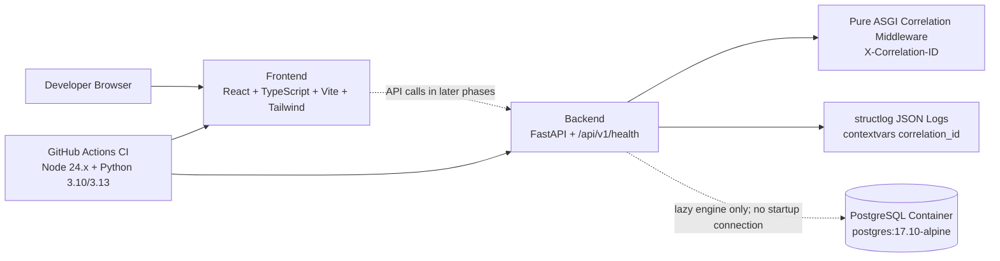

# RelayGuard Phase 1A Architecture

PostgreSQL remains unconnected during startup and normal unit tests. Phase 1A adds SQLAlchemy 2 async engine/sessionmaker infrastructure for future integration work, but it does not add ORM models, migrations, or database readiness checks.
