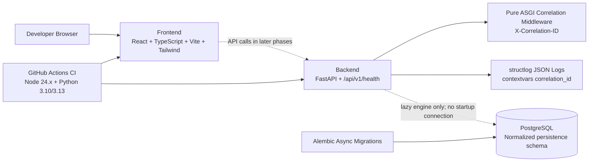

# RelayGuard Phase 1C Architecture

PostgreSQL remains unconnected during startup and normal unit tests. Phase 1B added SQLAlchemy ORM metadata and an immutable initial Alembic migration for the normalized persistence foundation. Phase 1C adds idempotent seeding, PostgreSQL-only integration validation against the isolated test database on host port `5434`, and a forward `0002` migration that expands replay-request terminal statuses.

The schema uses UUID primary keys, UTC-aware timestamp columns, string status columns with check constraints, JSONB only for payload/configuration/schema/audit documents, and PostgreSQL partial unique indexes where domain rules require them.

Phase 1C adds idempotent baseline seeding, PostgreSQL-only integration tests, Makefile database targets, and a backend PostgreSQL integration CI job. Normal health/startup behavior and `make check` remain database-free.

Runtime reliability behavior is still not implemented. Webhook processing, retry execution, replay execution, and AI execution remain deferred.
