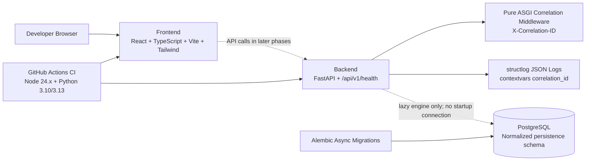

# RelayGuard Phase 1B Architecture

PostgreSQL remains unconnected during startup and normal unit tests. Phase 1B adds SQLAlchemy ORM metadata and an initial Alembic migration for the normalized persistence foundation, validated against the isolated test database on host port `5434`.

The schema uses UUID primary keys, UTC-aware timestamp columns, string status columns with check constraints, JSONB only for payload/configuration/schema/audit documents, and PostgreSQL partial unique indexes where domain rules require them.

Phase 1B does not add idempotent seed data, PostgreSQL integration tests, Makefile database targets, a CI PostgreSQL integration job, or runtime reliability behavior. Webhook processing, retry execution, replay execution, and AI execution remain deferred to the next Phase 1 slice.
